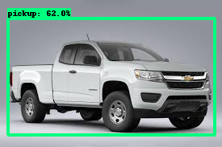

# Car detection based on type
This repository  is of  the basic car detection and classification based on type like SUV,and pickup,Sedan etc and it is based on the newly introduced TensorFlow Object Detection API for training a custom object detector with TensorFlow 2.X versions. The steps mentioned mostly follow this [documentation](https://tensorflow-object-detection-api-tutorial.readthedocs.io/en/latest/training.html#), however I have simplified the steps and the process


In this repository, I have gathered and labelled my own dataset for car detection based on type
Dataset is contain inside workspace/data
I have created 5 labels inside label_map.pbtxt:

```
item {
    name: "pickup",
    id: 1,
    display_name: "pickup"
}
item {
    name: "SUV",
    id: 2,
    display_name: "SUV"
}


```

I have taken pretrained STOA model EfficientDet D1 640x640 from [TensorFlow 2 Detection Model Zoo](https://github.com/tensorflow/models/blob/master/research/object_detection/g3doc/tf2_detection_zoo.md)


Real beauty of choosing TensorFlow Object Detection API is that we can choose to do transfer learning from any of STOA model available in TensorFlow 2 Detection Model Zoo.

## The Steps
### Git clone the repo
```
https://github.com/vinodgit44/vehicle_detection.git
```
This should clone all the files in a directory called car_detection.

Go to  project directory:
```
cd vehicle_detection/
```


create venv via pip
```
pip3 install virtualenv
virtualenv venv
```
activate virtual environment
```
source venv/bin/activate
```
Install dependencies with 

```
pip3 install requirment.txt
```

Then, your directory structure should look something like this:

```
TensorFlow/
└─ models/
   ├─ community/
   ├─ official/
   ├─ orbit/
   ├─ research/
└─ scripts/
└─ workspace/
 ├─ data/
 ├─ training_demo/
```
After we have setup the directory structure, we must install the prequisites for the Object Detection API. First we need to install the protobuf compiler

```
pip3 install protobuf
sudo apt  install protobuf-compiler
```
Then you should cd in to the TensorFlow\models\research directory

```
cd models/research
```
Then compile the protos

```
protoc object_detection/protos/*.proto --python_out=.
```

With TensorFlow 2, pycocotools is a dependency for the Object Detection API. 

```
pip3 install cython
pip3 install git+https://github.com/philferriere/cocoapi.git#subdirectory=PythonAPI
```

Go back to the models/research directory with 

```
cd models\research
```

Once here, copy and run the setup script with 
sudo apt  install protobuf-compiler 
```
cp object_detection/packages/tf2/setup.py .
python3 -m pip install .
```
If there are any errors, report an issue, but they are most likely pycocotools issues meaning your installation was incorrect. But if everything went according to plan you can test your installation with

```
python object_detection/builders/model_builder_tf2_test.py
```
You should get a similar output to this

```
[       OK ] ModelBuilderTF2Test.test_create_ssd_models_from_config
[ RUN      ] ModelBuilderTF2Test.test_invalid_faster_rcnn_batchnorm_update
[       OK ] ModelBuilderTF2Test.test_invalid_faster_rcnn_batchnorm_update
[ RUN      ] ModelBuilderTF2Test.test_invalid_first_stage_nms_iou_threshold
[       OK ] ModelBuilderTF2Test.test_invalid_first_stage_nms_iou_threshold
[ RUN      ] ModelBuilderTF2Test.test_invalid_model_config_proto
[       OK ] ModelBuilderTF2Test.test_invalid_model_config_proto
[ RUN      ] ModelBuilderTF2Test.test_invalid_second_stage_batch_size
[       OK ] ModelBuilderTF2Test.test_invalid_second_stage_batch_size
[ RUN      ] ModelBuilderTF2Test.test_session
[  SKIPPED ] ModelBuilderTF2Test.test_session
[ RUN      ] ModelBuilderTF2Test.test_unknown_faster_rcnn_feature_extractor
[       OK ] ModelBuilderTF2Test.test_unknown_faster_rcnn_feature_extractor
[ RUN      ] ModelBuilderTF2Test.test_unknown_meta_architecture
[       OK ] ModelBuilderTF2Test.test_unknown_meta_architecture
[ RUN      ] ModelBuilderTF2Test.test_unknown_ssd_feature_extractor
[       OK ] ModelBuilderTF2Test.test_unknown_ssd_feature_extractor
----------------------------------------------------------------------
Ran 20 tests in 45.304s

OK (skipped=1)
```
This means we successfully set up the  Directory Structure and TensorFlow Object Detection API. 

### Configuring the Training Pipeline

we will use a CONFIG File from one of the TensorFlow pre-trained models. There are plenty of models in the [TensorFlow Model Zoo](https://github.com/tensorflow/models/blob/master/research/object_detection/g3doc/tf2_detection_zoo.md), but we will use the **SSD MobileNet v2 320x320**, as it is on the faster end of the spectrum with decent performance. If you want you can choose a different model, but you will have to alter the steps slightly.

To download the model you want, just click on the name in the TensorFlow Model Zoo. This should download a tar.gz file. Once it has downloaded, extracts the contents of the file to the ```workspace/training_demo/pre-trained-models``` directory.


Following action is optional(**already configured file inside model directory**)(if you want to check parameters or want to change configuration )
############configuration
Replace ```workspace/training_demo/models/ssd_mobilenet_v2_320x320_coco17_tpu-8/pipeline.config```  file inside model with ```workspace/training_demo/pre-trained-models/ssd_mobilenet_v2_320x320_coco17_tpu-8/pipeline.config```
```
Now folder structure look like this.
Training_demo/
├─ ...
├─ models/
│  └─ssd_mobilenet_v2_320x320_coco17_tpu-8/
│     └─ pipeline.config
└─ ...

```

Then open up ```workspace/training_demo/models/ssd_mobilenet_v2_320x320_coco17_tpu-8/pipeline.config``` in a text editor because we need to make some changes.
- Line 3. Change ```num_classes``` to the number of classes your model detects. For the basketball, baseball, and football, example you would change it to ```num_classes: 5```
- Line 138. Change ```batch_size``` according to available memory (Higher values require more memory and vice-versa). I changed it to:
  - ```batch_size: 6```
- Line 162. Change ```fine_tune_checkpoint``` to:
  - ```fine_tune_checkpoint: "pre-trained-models/ssd_mobilenet_v2_320x320_coco17_tpu-8/checkpoint/ckpt-0"```
- Line 168. Change ```fine_tune_checkpoint_type``` to:
  - ```fine_tune_checkpoint_type: "detection"```
- Line 172. Change ```label_map_path``` to:
  - ```label_map_path: "workspace/data/train/train.pbtxt"```
- Line 174. Change ```input_path``` to:
  - ```input_path: "workspace/data/train/train.tfrecord"```
- Line 182. Change ```label_map_path``` to:
  - ```label_map_path: "workspace/data/train/train.pbtxt"```
- Line 186. Change ```input_path``` to:
  - ```input_path: "workspace/data/valid/test.tfrecord"```

Once we have made all the necessary changes, that means we are ready for training. So let's move on to the next step!
###Labelled dataset resides in **workspace/data** directory (train or valid)
### Training the Model
Now you go back to your Anaconda Prompt. ```cd``` in to the ```training_demo``` with 

```
cd C:\TensorFlow\workspace\training_demo
```

I have already moved the training script in to the directory, so to run it just use 

```
python model_main_tf2.py --model_dir=models\ssd_mobilenet_v2_320x320_coco17_tpu-8 --pipeline_config_path=models\ssd_mobilenet_v2_320x320_coco17_tpu-8\pipeline.config
```

When running the script, you should expect a few warnings but as long as they're not errors you can ignore them. Eventually when the training process starts you should see output similar to this

```
INFO:tensorflow:Step 100 per-step time 0.640s loss=0.454
I0810 11:56:12.520163 11172 model_lib_v2.py:644] Step 100 per-step time 0.640s loss=0.454
````


###Exporting the Inference Graph

Once you have finished training and stopped the script, you are ready to export your finished model! You should still be in the ```training``` directory but if not use

```
cd C:\TensorFlow\workspace\training_demo
```

I have already moved the script needed to export, so all you need to do is run this command

```
python3 exporter_main_v2.py --input_type image_tensor --pipeline_config_path ../models/ssd_mobilenet_v2_320x320_coco17_tpu-8/pipeline.config --output_directory ../exported-models/my_mobilenet_model --trained_checkpoint_dir ../models/ssd_mobilenet_v2_320x320_coco17_tpu-8
```

**Note that if you get an error similar to ```TypeError: Expected Operation, Variable, or Tensor, got block4 in exporter_main_v2.py``` look at [this](https://github.com/tensorflow/models/issues/8881) error topic**

But if this program finishes successfully, then model is finished! It should be located in the ```\workspace\training_demo\exported-models\my_mobilenet_model\saved_model``` folder. There should be an PB File called ```saved_model.pb```. This is the inference graph!


### Model inference:

To test out your model, you can use the sample object detection script I provided called ```TF-image.py```. This should be located in ```workspace/training```.
The usage of each program looks like 

```
usage: TF-image.py [-h] [--model MODEL] [--labels LABELS] [--image IMAGE] [--threshold THRESHOLD]

optional arguments:
  -h, --help            show this help message and exit
  --model MODEL         Folder that the Saved Model is Located In
  --labels LABELS       Where the Labelmap is Located
  --image IMAGE         Name of the single image to perform detection on
  --threshold THRESHOLD Minimum confidence threshold for displaying detected objects
```
If the model or labelmap is located anywhere other than where I put them, you can specify the location with those arguments. You must also provide an image to perform inference on.

```
cd workspace/training_demo
```

Then to run the script, just use

```
python3 TF-image-od.py --model=exported-models/my_mobilenet_model --labels=annotations/train.pbtxt --image=images/c.jpg --threshold=0.70

``` 


If everything works properly you should get an output similar to this
<p align="center">
  

    
    


</p>

**These results are only based on few set training of data.**

**we got are initial output but we can improve are accuracy by training on large dataset aswell as by choosing another initial pretrained weight if required.**
